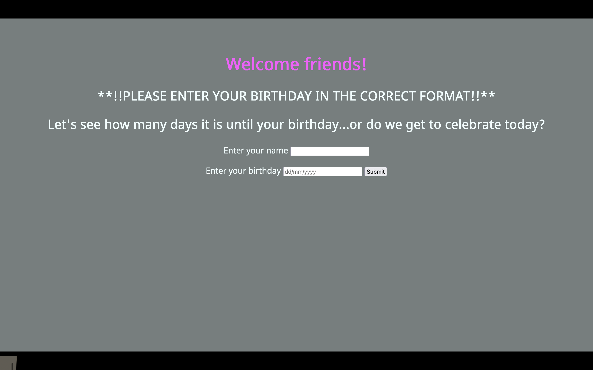

# Birthday App
==============

## Project Outline:

Birthday calculator app written in Ruby and using html and css
Web app that will ask the user for a name and birthday
When the user submits the form, and depending on the current date, the app will either:

    - wish the user happy birthday
    - tell them how long they'll have to wait until their next birthday

User information is stored in a database as part of the process

## User Stories:
As a user, if my birthday is today I want the app to wish me a happy birthday
As a user, if my birthday is not today I want the app to tell me how many days it is until my birthday

## Process
Approach:
    - Broke the task down into clear user stories
    - Set up Ruby web project folders
    - Started with writing failing test for user journeys
    - Used TDD (red, green, refactor) to work through each story  
    - Started with feature tests and broke these down into more focused unit tests
    - When app fully working added database to project

## Domain Model:

## Views:
Landing page

Enter details

Birthday in the future

Birthday greeting

Flash message when date format entered incorrectly 

## Instructions
 - Clone the repo
 - Run: gem install rspec
 - Run: gem install rubocop
 - Run: bundle

## Create Database
 - Connect to psql
 - Create the database using the psql command CREATE DATABASE birthdayapp;
 - Connect to the database using the pqsl command \c birthdayapp;
 - Run the query we have saved in the file CREATE_DATABASE.SQL

## Run your local server
 - run rackup 
 - open browser address http://localhost:9292/

## Technical
 Tech & Frameworks utilised Ruby, HTML, CSS, PostgreSQL, Rspec, Capybara, Simplecov, Sinatra and Rubocop. All classes isolated with 95% test coverage

##  Updates to make
- Create test environment for database
- Setup/connect Twilio and create new 'send greeting' page that enables user to send birthday message to friend

## Nice to have
- API set up - informaation of news from year of birth