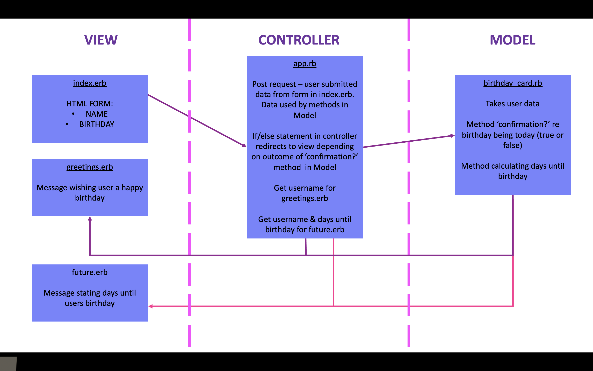
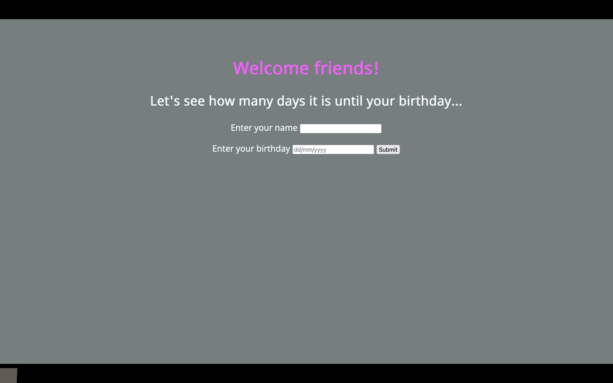
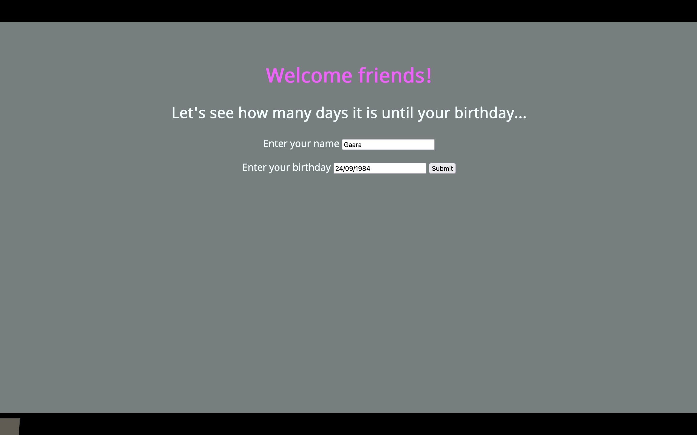
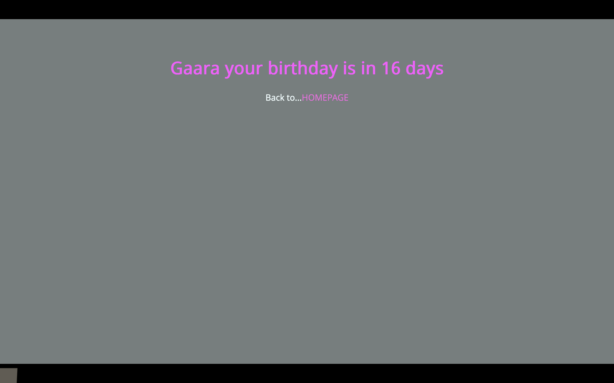
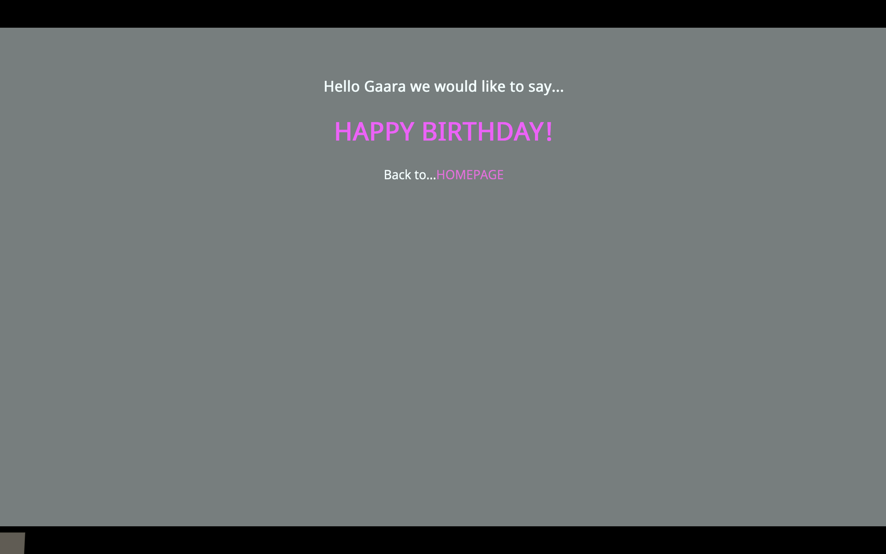

# Birthday App
==============

## Challenge:

Birthday calculator app written in Ruby and using html and css

Challenge is to build a web app that will ask the user for a name and birthday.

When the user submits the form, and depending on the current date, the app will either:

    - wish the user happy birthday
    - tell them how long they'll have to wait until their next birthday

## User Stories:

As a user, if my birthday is today I want the app to wish me a happy birthday

As a user, if my birthday is not today I want the app to tell me how many days it is until my birthday

## Domain Model:

## Views:
Landing page

Enter details

Birthday in the future

Birthday greeting

## Instructions
 - Clone the repo
 - run bundle

## Run your local server
 - run rackup 
 - open browser address http://localhost:9292/

## Technical
 Tech & Frameworks utilised Ruby, HTML, CSS,  Rspec, Simplecov, Rubocop. All classes isolated with 96.7% test coverage